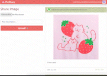

# pixi share ( ๑‾̀◡‾́)σ"

I created this DApp out of curiosity about how a decentralized app would work :) It is essentially an image-sharing platform with the Ethereum blockchain as the data storage place and allows for user tokenization ( ͡° ͜ʖ ͡° )

The idea behind using blockchain technology for social media is that it offers users ownership and control over their data while countering algorithmic content filtering. It provides a decentralized and transparent platform for sharing news media and opinions :).

## Project Demo
 

## Features
- [x] Upload and share pictures with a description
- [x] Connect to users' non-custodial wallets
- [x] Tip other users in Ether (ETH)
- [x] Receive tips from other users
- [x] View a feed of shared pictures and descriptions
- [x] Decentralized and transparent platform
- [x] Ownership and control over user data
- [x] Censorship-resistant social media experience

## Tech Used
- [x] Ethereum blockchain
- [x] Solidity smart contracts
- [x] Node.js
- [x] React
- [x] Bootstrap for CSS
- [x] IPFS (InterPlanetary File System)

## Acknowledgments
[Dapp University](https://www.dappuniversity.com/) for the tutorial and inspiration ٩꒰ʘʚʘ๑꒱۶

